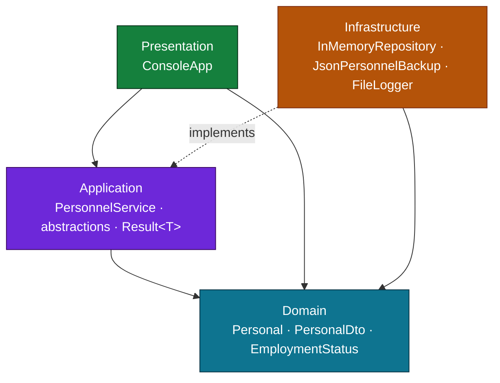
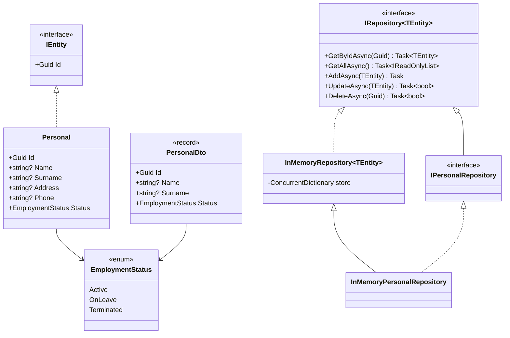
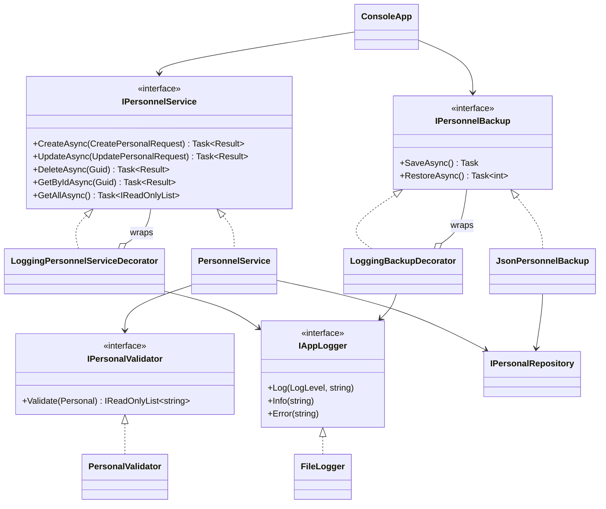
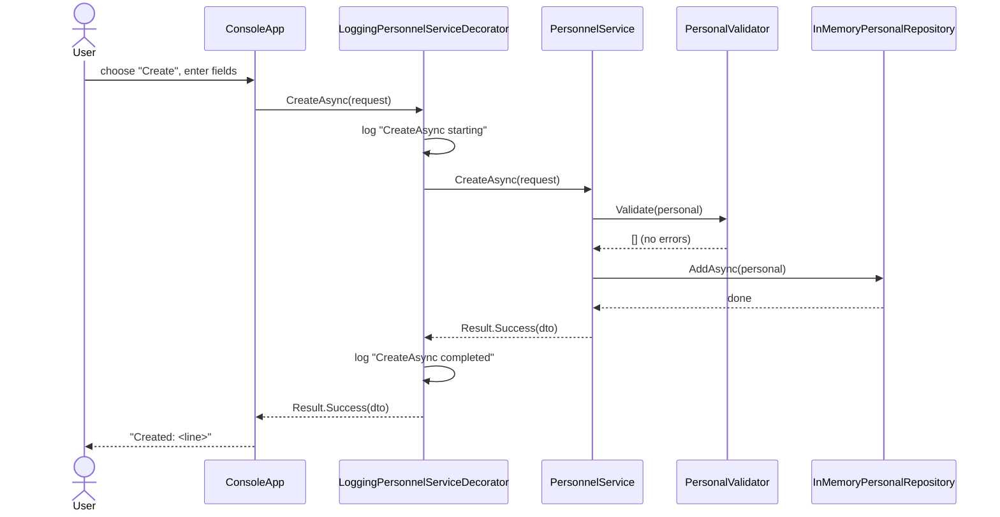
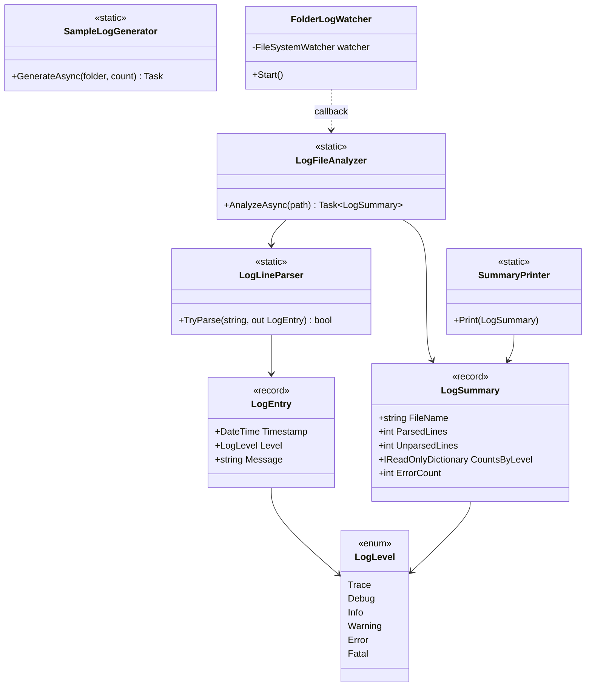
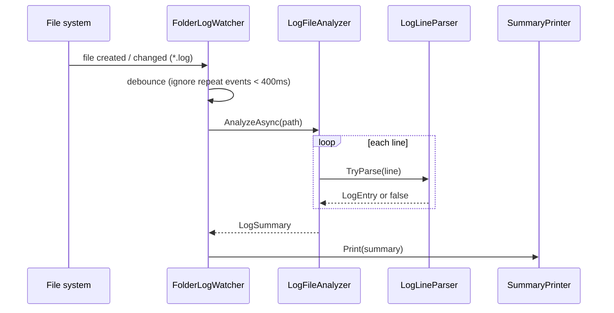

# PersonnelManager & LogAnalyzer

A two-project **.NET 10 / C# 14** solution built as a hands-on tour of modern C# and clean
application design.

| Project | What it is |
|---|---|
| **PersonnelManager** | A layered, SOLID, **service-based** in-memory CRUD app for managing people, with validation, JSON file persistence, and cross-cutting logging. |
| **LogAnalyzer** | A console tool that **watches a folder** for new/changed `.log` files, summarizes them by severity, and can generate sample logs for testing. |

Both are console apps. There are two xUnit test projects with **60 passing tests** between them.

---

## Table of contents

- [Overview](#overview)
- [Solution structure](#solution-structure)
- [Getting started](#getting-started)
- [PersonnelManager](#personnelmanager)
  - [Architecture (layers)](#architecture-layers)
  - [Class diagram — domain & persistence](#class-diagram--domain--persistence)
  - [Class diagram — service & cross-cutting](#class-diagram--service--cross-cutting)
  - [Sequence — creating a person](#sequence--creating-a-person)
- [LogAnalyzer](#loganalyzer)
  - [Class diagram](#class-diagram)
  - [Sequence — watch & analyze](#sequence--watch--analyze)
- [Knowledge / concepts covered](#knowledge--concepts-covered)
- [Testing](#testing)

---

## Overview

**PersonnelManager** keeps a list of people in memory and exposes create / read / update / delete
through an interactive console menu. It is deliberately structured as a small **Clean Architecture**
app so that each concern is isolated and testable:

- the **domain** owns the entity and its rules,
- the **application** layer owns the use cases (a single `PersonnelService`) behind abstractions,
- the **infrastructure** layer supplies concrete implementations (in-memory store, JSON backup, file logger),
- the **presentation** layer is a console UI that depends only on abstractions.

Cross-cutting concerns (logging) are added with the **Decorator pattern**, so no use-case code is
touched to gain logging.

**LogAnalyzer** is a separate utility that reads the exact log format PersonnelManager's `FileLogger`
produces (`yyyy-MM-dd HH:mm:ss.fff [Level] message`). It parses log lines tolerantly, counts them by
level, reports error samples and time spans, and uses a debounced `FileSystemWatcher` to re-analyze
files as they change.

---

## Solution structure

```
PersonnelManager.sln
├── PersonnelManager/                 # main CRUD app
│   ├── domain/                       # entity, DTO, enum, IEntity  (no dependencies)
│   ├── application/
│   │   ├── abstractions/             # interfaces, Result<T>, decorators
│   │   └── personnel/                # PersonnelService, validator, mapping
│   ├── infrastructure/               # in-memory repo, JSON backup, file logger
│   ├── presentation/                 # ConsoleApp + display extensions
│   └── Program.cs                    # composition root
├── PersonnelManager.Tests/           # 50 xUnit tests
├── LogAnalyzer/                      # log-watching utility
│   ├── Domain/                       # LogLevel, LogEntry, LogSummary
│   ├── LogLineParser.cs
│   ├── LogFileAnalyzer.cs
│   ├── SampleLogGenerator.cs
│   ├── FolderLogWatcher.cs
│   ├── SummaryPrinter.cs
│   └── Program.cs                    # CLI: generate | watch | analyze | demo
└── LogAnalyzer.Tests/                # 10 xUnit tests
```

---

## Getting started

```bash
# Build everything
dotnet build

# Run all tests (60)
dotnet test

# Run the CRUD app (interactive menu; also accepts commands: find <term>, delete <id>, help)
dotnet run --project PersonnelManager

# Log analyzer
dotnet run --project LogAnalyzer -- generate test-logs 10   # write 10 sample .log files
dotnet run --project LogAnalyzer -- analyze test-logs/auth-01.log
dotnet run --project LogAnalyzer -- watch  test-logs        # analyze, then watch for changes
dotnet run --project LogAnalyzer -- demo                    # self-contained: generate + watch + inject changes
```

---

## PersonnelManager

### Architecture (layers)

Dependencies point **inward** — outer layers depend on inner abstractions, never the reverse.



The **composition root** (`Program.cs`) is the only place that knows concrete types: it builds the
repository, validator, logger, service, and backup — wrapping the service and backup in logging
decorators — then hands the abstractions to `ConsoleApp`.

### Class diagram — domain & persistence

Shows the generic repository and how the `Personal` store is just a one-line specialization.



### Class diagram — service & cross-cutting

The use-case service, its logging decorator, and the persistence/logging seams.



### Sequence — creating a person

Note how the logging decorator is transparent: the console calls `IPersonnelService`, unaware a
decorator sits in front of the real service.



---

## LogAnalyzer

CLI with four commands: `generate`, `watch`, `analyze`, `demo` (dispatched with **list patterns**
on `args`).

### Class diagram



### Sequence — watch & analyze



---

## Knowledge / concepts covered

This solution was built lesson-by-lesson; nearly every construct maps to a real file.

### C# 14 / modern language features

| Feature | Where |
|---|---|
| `field` keyword (backing-field access in setters) | `domain/Personel.cs` |
| Extension **members** — instance & **static** properties, methods | `personnel/PersonalMapping.cs`, `presentation/PersonnelDisplayExtensions.cs` |
| `System.Threading.Lock` (C# 13 lock type) | `infrastructure/FileLogger.cs` |
| Default interface methods | `IAppLogger.Info/Warning/Error` |
| Primary constructors | services, handlers, decorators |
| Records & `readonly record struct` | `PersonalDto`, request records, `Result<T>` |
| Collection expressions `[.. ]` | repositories, mapping, analyzer |
| Pattern matching — property, `is null`, switch expressions | services, `ConsoleApp` |
| **List patterns** (`["find", .. terms]`, args dispatch) | `ConsoleApp`, LogAnalyzer `Program.cs` |
| Generics + constraints (`where TEntity : IEntity`) | `IRepository<T>`, `InMemoryRepository<T>` |
| `async` / `await` over real I/O | `JsonPersonnelBackup`, `LogFileAnalyzer` |
| Delegates / `Func` / `Predicate` (rules as data) | `PersonalValidator`, `Result.Match` |
| Nullable reference types | solution-wide (`<Nullable>enable</Nullable>`) |
| Enums + exhaustive switch | `EmploymentStatus`, `LogLevel` |

### Design & architecture

- **Clean / layered architecture** with the Dependency Inversion Principle (abstractions in the
  application layer, implementations in infrastructure).
- **SOLID** — single-responsibility service methods, interface segregation, DI via constructors.
- **Decorator pattern** for cross-cutting logging (`LoggingPersonnelServiceDecorator`,
  `LoggingBackupDecorator`) — Open/Closed in action.
- **Repository pattern**, generic and reusable.
- **Result type** instead of exceptions for expected failures.
- **Composition root** for wiring; no service locator, no magic.
- **File watching** with `FileSystemWatcher` (debouncing, shared-read handles).

---

## Testing

```bash
dotnet test          # runs both test projects
```

| Test project | Tests | Focus |
|---|---|---|
| `PersonnelManager.Tests` | 50 | service, validator, repository, backup, logging decorators, extensions, console flows |
| `LogAnalyzer.Tests` | 10 | line parser (valid / aliases / malformed), file analyzer (counts, time span, errors) |

Tests use the real in-memory implementations as honest test doubles where possible, plus small
hand-rolled fakes (recording logger, throwing service/backup) for edge cases — no mocking framework.

---

*Built with .NET 10 and C# 14.*
