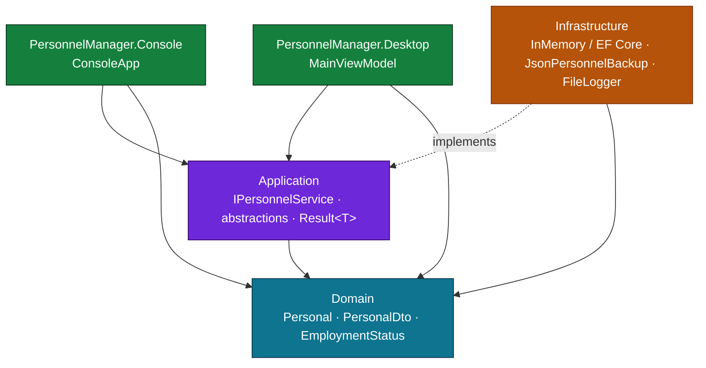
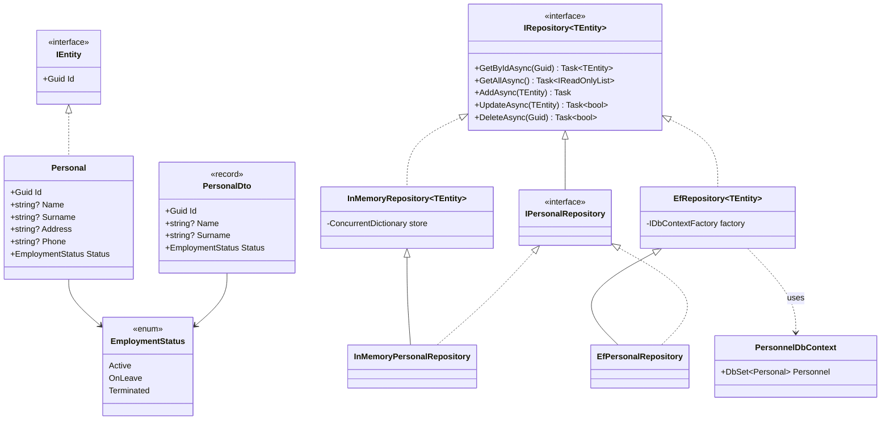
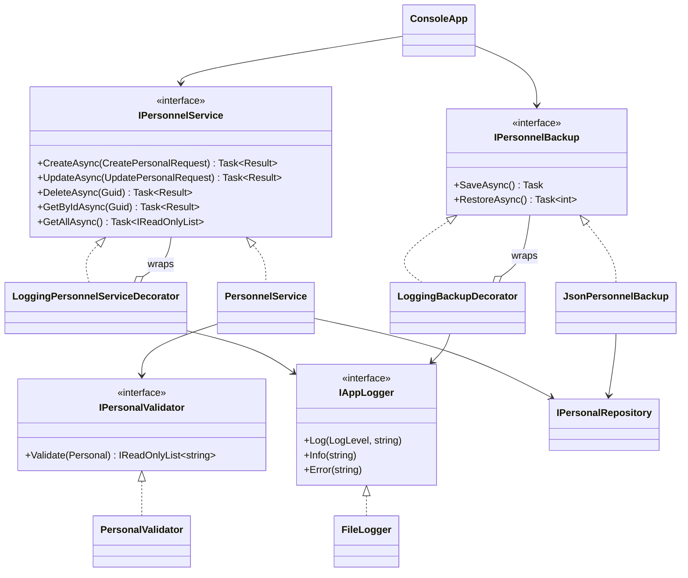
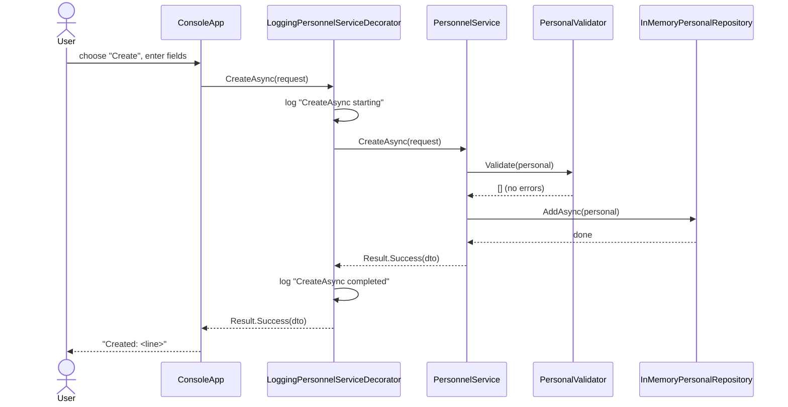
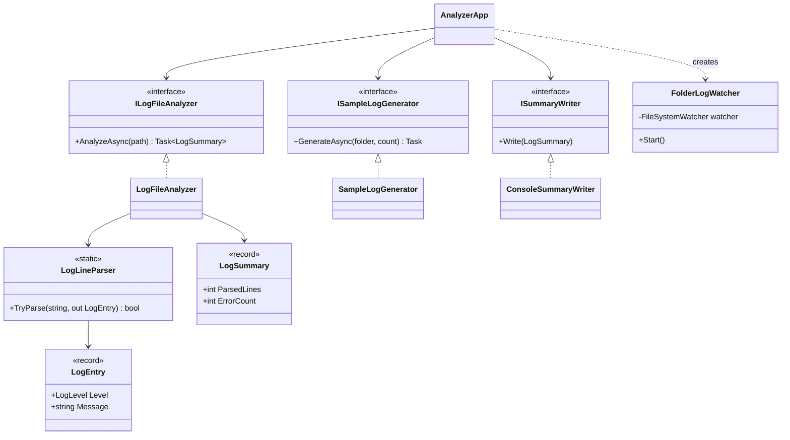
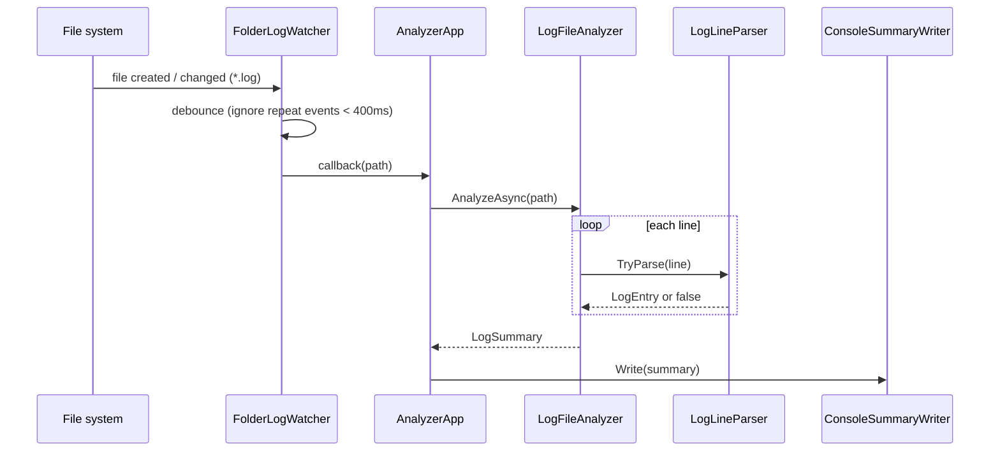

# PersonnelManager & LogAnalyzer

[](https://github.com/BenoitGoethals/PersonalManager/actions/workflows/ci.yml)
[](LICENSE)
[](https://dotnet.microsoft.com/)

A **.NET 10 / C# 14** solution built as a hands-on tour of modern C# and clean application design.
The core is a class library shared by **two interchangeable front-ends** — a console app and an
**Avalonia** desktop app — plus a separate log-watching utility.

| Project | What it is |
|---|---|
| **PersonnelManager** (Core library) | Layered, SOLID, **service-based** CRUD for managing people: domain, use cases, validation, logging decorators, and a repository that runs **in-memory or on PostgreSQL via EF Core**. |
| **PersonnelManager.Console** | A console/terminal front-end over the core. |
| **PersonnelManager.Desktop** | An **Avalonia UI (MVVM)** desktop front-end over the same core. |
| **LogAnalyzer** | A console tool that **watches a folder** for new/changed `.log` files, summarizes them by severity, and generates sample logs for testing. |

Everything is wired with **dependency injection** (`Microsoft.Extensions.DependencyInjection`).
Three xUnit test projects hold **70 passing tests**.

---

## Table of contents

- [Overview](#overview)
- [Solution structure](#solution-structure)
- [Getting started](#getting-started)
- [PersonnelManager](#personnelmanager)
  - [Architecture (layers)](#architecture-layers)
  - [Class diagram — domain & persistence](#class-diagram--domain--persistence)
  - [Class diagram — service & cross-cutting](#class-diagram--service--cross-cutting)
  - [Sequence — creating a person](#sequence--creating-a-person)
- [LogAnalyzer](#loganalyzer)
  - [Class diagram](#class-diagram)
  - [Sequence — watch & analyze](#sequence--watch--analyze)
- [Knowledge / concepts covered](#knowledge--concepts-covered)
- [Testing](#testing)
- [Continuous integration](#continuous-integration)
- [License](#license)

---

## Overview

**PersonnelManager** manages a list of people with create / read / update / delete. It is
deliberately structured as **Clean Architecture** so each concern is isolated and testable:

- the **domain** owns the entity and its rules,
- the **application** layer owns the use cases (a single `PersonnelService`) behind abstractions,
- the **infrastructure** layer supplies implementations (in-memory *or* EF Core / PostgreSQL store, JSON backup, file logger),
- **presentation is separate**: two host projects (console, Avalonia) each depend only on the core abstractions.

The core is a **class library** with no dependency on any UI. Each front-end has its own tiny
composition root that registers the shared core (`AddPersonnelManager`) plus its own presentation
types. Swapping the store (in-memory ↔ PostgreSQL) is one branch in that registration; nothing above
infrastructure changes. Cross-cutting logging is added with the **Decorator pattern**, so no use-case
code is touched to gain it.

**LogAnalyzer** reads the exact log format PersonnelManager's `FileLogger` produces
(`yyyy-MM-dd HH:mm:ss.fff [Level] message`), parses lines tolerantly, counts them by level, reports
error samples and time spans, and uses a debounced `FileSystemWatcher` to re-analyze files as they
change.

---

## Solution structure

```
PersonnelManager.sln
├── PersonnelManager/                 # CORE class library (no UI dependency)
│   ├── domain/                       # entity, DTO, enum, IEntity  (no dependencies)
│   ├── application/
│   │   ├── abstractions/             # interfaces, Result<T>, decorators
│   │   └── personnel/                # PersonnelService, validator, mapping
│   ├── infrastructure/
│   │   ├── persistence/              # EF Core: DbContext, EfRepository<T>, EfPersonalRepository
│   │   ├── InMemoryRepository / InMemoryPersonalRepository
│   │   ├── JsonPersonnelBackup, FileLogger
│   ├── composition/                  # AddPersonnelManager (core DI registration)
│   └── Migrations/                   # EF Core migration (InitialCreate)
├── PersonnelManager.Console/         # console FRONT-END → refs Core
│   ├── ConsoleApp.cs, PersonnelDisplayExtensions.cs
│   └── Program.cs                    # console composition root
├── PersonnelManager.Desktop/         # Avalonia (MVVM) FRONT-END → refs Core
│   ├── ViewModels/MainViewModel.cs
│   ├── Views/MainWindow.axaml (+ .cs)
│   ├── App.axaml.cs                  # desktop composition root
│   └── Program.cs
├── PersonnelManager.Tests/           # 56 xUnit tests (refs Core + Console)
├── PersonnelManager.Desktop.Tests/   # 3 view-model tests
├── LogAnalyzer/                      # log-watching utility (DI-wired)
│   ├── Domain/, Abstractions.cs, LogLineParser.cs, LogFileAnalyzer.cs
│   ├── SampleLogGenerator.cs, ConsoleSummaryWriter.cs, FolderLogWatcher.cs
│   ├── AnalyzerApp.cs, ServiceCollectionExtensions.cs, Program.cs
└── LogAnalyzer.Tests/                # 11 xUnit tests
```

---

## Getting started

```bash
# Build everything
dotnet build

# Run all tests (70)
dotnet test

# CRUD app — pick a front-end (both share the same core):
dotnet run --project PersonnelManager.Console   # terminal menu (find <term>, delete <id>, help)
dotnet run --project PersonnelManager.Desktop   # Avalonia desktop window (needs a desktop session)

# Log analyzer
dotnet run --project LogAnalyzer -- generate test-logs 10   # write 10 sample .log files
dotnet run --project LogAnalyzer -- analyze test-logs/auth-01.log
dotnet run --project LogAnalyzer -- watch  test-logs        # analyze, then watch for changes
dotnet run --project LogAnalyzer -- demo                    # self-contained: generate + watch + inject changes
```

### Using PostgreSQL instead of the in-memory store

Both CRUD front-ends read a connection string from the `PERSONNEL_DB` environment variable. Set it
and they store people in PostgreSQL via EF Core; leave it unset and they use the in-memory store.
The secret stays in your environment — never in source.

```bash
export PERSONNEL_DB="Host=<host>;Database=personnel;Username=<user>;Password=<secret>"
dotnet ef database update --project PersonnelManager   # apply the InitialCreate migration
dotnet run --project PersonnelManager.Console          # now backed by PostgreSQL
```

---

## PersonnelManager

### Architecture (layers)

Dependencies point **inward** — outer layers depend on inner abstractions, never the reverse.

Dependencies point **inward**. The two front-ends (Console, Avalonia) live *outside* the core
library and depend only on its application abstractions.



Wiring is done with **dependency injection** (`Microsoft.Extensions.DependencyInjection`).
`AddPersonnelManager` (in the core's `composition/`) registers the shared services — repository
(in-memory or EF Core, chosen by connection string) and the two logging **decorators**, registered
as factories that wrap the concrete service and backup. **Each front-end has its own composition
root** (`Program.cs` for the console, `App.axaml.cs` for Avalonia) that calls `AddPersonnelManager`
and then registers its own presentation type (`ConsoleApp` / `MainViewModel`). The core library
names no UI type.

### Class diagram — domain & persistence

Shows the generic repository and its two implementations — the in-memory store and the EF Core /
PostgreSQL store — each closed over `Personal` in a one-line specialization.



### Class diagram — service & cross-cutting

The use-case service, its logging decorator, and the persistence/logging seams.



### Sequence — creating a person

Note how the logging decorator is transparent: the console calls `IPersonnelService`, unaware a
decorator sits in front of the real service.



---

## LogAnalyzer

CLI with four commands: `generate`, `watch`, `analyze`, `demo` (dispatched with **list patterns**
on `args`).

### Class diagram

The command handlers (`AnalyzerApp`) depend on three injected interfaces. `LogLineParser` stays a
pure static function — nothing to inject.



### Sequence — watch & analyze



---

## Knowledge / concepts covered

This solution was built lesson-by-lesson; nearly every construct maps to a real file.

### C# 14 / modern language features

| Feature | Where |
|---|---|
| `field` keyword (backing-field access in setters) | `domain/Personel.cs` |
| Extension **members** — instance & **static** properties, methods | `personnel/PersonalMapping.cs`, `presentation/PersonnelDisplayExtensions.cs` |
| `System.Threading.Lock` (C# 13 lock type) | `infrastructure/FileLogger.cs` |
| Default interface methods | `IAppLogger.Info/Warning/Error` |
| Primary constructors | services, handlers, decorators |
| Records & `readonly record struct` | `PersonalDto`, request records, `Result<T>` |
| Collection expressions `[.. ]` | repositories, mapping, analyzer |
| Pattern matching — property, `is null`, switch expressions | services, `ConsoleApp` |
| **List patterns** (`["find", .. terms]`, args dispatch) | `ConsoleApp`, LogAnalyzer `Program.cs` |
| Generics + constraints (`where TEntity : IEntity`) | `IRepository<T>`, `InMemoryRepository<T>` |
| `async` / `await` over real I/O | `JsonPersonnelBackup`, `LogFileAnalyzer` |
| Delegates / `Func` / `Predicate` (rules as data) | `PersonalValidator`, `Result.Match` |
| Nullable reference types | solution-wide (`<Nullable>enable</Nullable>`) |
| Enums + exhaustive switch | `EmploymentStatus`, `LogLevel` |

### Design & architecture

- **Clean / layered architecture** with the Dependency Inversion Principle (abstractions in the
  application layer, implementations in infrastructure).
- **SOLID** — single-responsibility service methods, interface segregation, DI via constructors.
- **Decorator pattern** for cross-cutting logging (`LoggingPersonnelServiceDecorator`,
  `LoggingBackupDecorator`) — Open/Closed in action.
- **Repository pattern**, generic and reusable.
- **Result type** instead of exceptions for expected failures.
- **Dependency injection** (`Microsoft.Extensions.DependencyInjection`) — a `ServiceCollection`
  describes the graph and the container resolves each constructor's dependencies; decorators are
  registered as factory wrappers. Wiring is verified by tests.
- **Presentation / core separation** — the core is a UI-agnostic class library shared by two
  front-ends (**Console** and **Avalonia MVVM**); each has its own composition root.
- **EF Core + PostgreSQL** (`Npgsql`) behind the repository abstraction, selected by connection
  string; the in-memory store is the default. An `InitialCreate` migration is included.
- **MVVM** with CommunityToolkit — `MainViewModel` depends only on `IPersonnelService`, so the UI
  logic is unit-tested with no GUI.
- **File watching** with `FileSystemWatcher` (debouncing, shared-read handles).

---

## Testing

```bash
dotnet test          # runs all three test projects
```

| Test project | Tests | Focus |
|---|---|---|
| `PersonnelManager.Tests` | 56 | service, validator, repository, backup, logging decorators, extensions, console flows, DI registration (in-memory + EF paths) |
| `PersonnelManager.Desktop.Tests` | 3 | `MainViewModel` add / delete / validation — no GUI |
| `LogAnalyzer.Tests` | 11 | line parser (valid / aliases / malformed), file analyzer (counts, time span, errors), DI registration |

Tests use the real in-memory implementations as honest test doubles where possible, plus small
hand-rolled fakes (recording logger, throwing service/backup) for edge cases — no mocking framework.

---

## Continuous integration

Every push and pull request to `main` runs [`.github/workflows/ci.yml`](.github/workflows/ci.yml),
which has three jobs:

| Job | What it does |
|---|---|
| **Build · Test · Coverage** | `dotnet build`, then `dotnet test` with a TRX **test report** (published as a check run) and **code coverage** collected via coverlet; a ReportGenerator summary is written to the run summary and the HTML report is uploaded as an artifact. |
| **Dependency vulnerability scan** | `dotnet list package --vulnerable --include-transitive` — fails the build if any direct or transitive NuGet package has a known security advisory. |
| **CodeQL security analysis** | GitHub **CodeQL** static analysis (SAST) for C#; findings surface under the repo's *Security → Code scanning* tab. |

Coverage and test-result artifacts are downloadable from each run.

---

## License

Released under the [MIT License](LICENSE) — © 2026 Benoit Goethals.

---

*Built with .NET 10 and C# 14.*
